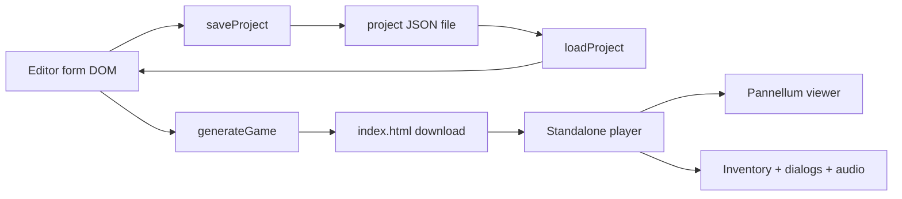
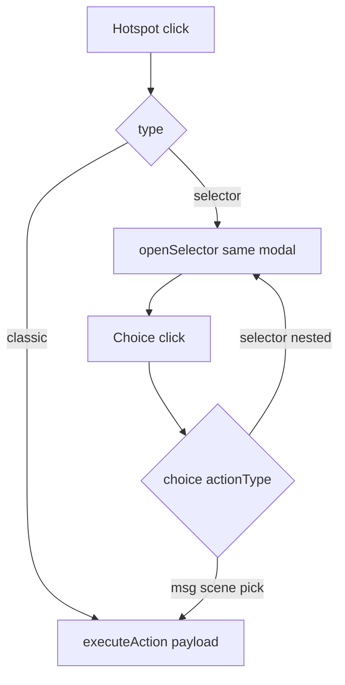

```mermaid
flowchart TD
  subgraph save [Sauvegarde projet]
    S1[DOM: formulaire selector + liste de cartes] --> S2[sync vers textarea f-sel-choices si mode formulaire]
    S2 --> S3[extractHotspotData]
    S3 --> S4["f_sel_choices = string JSON du tableau choices"]
    S4 --> S5[JSON.stringify project → fichier]
  end

  subgraph load [Chargement projet]
    L1[JSON.parse fichier] --> L2[addHotspot hsData]
    L2 --> L3["updateHsFields(hId, deferSelectorInit: true)"]
    L3 --> L4[Injection HTML selector sans init]
    L4 --> L5[forEach: remplir f-sel-choices, titre, intro, display…]
    L5 --> L6{selJsonExpertMode ?}
    L6 -->|oui| L7[toggleSelectorJsonExpert]
    L6 -->|non| L8[initSelectorChoicesForm]
    L8 --> L9["JSON.parse ta.value → racine + nested récursif"]
    L9 --> L10["Pour chaque choix: renderChoiceCardElement(ch, hId, depth)"]
    L10 --> L11["appendChild: carte créée hors document → hId explicite dans rebuild"]
    L11 --> L12[attachSelectorChoicesListeners + sync textarea]
  end
```

# Architecture — Escape Game 360° Maker

This document is for **developers** and **AI assistants** working on the repository. End-user instructions stay in the root [README.md](../README.md).

## Repository layout

| Path | Role |
|------|------|
| [editeur.html](../editeur.html) | Main editor (French UI): markup + `<link>` / `<script src>`. |
| [editor_en.html](../editor_en.html) | Same behavior, English UI; comments in English; default save as `project.json`. |
| [css/editor.css](../css/editor.css) | Shared editor chrome (layout, buttons, modals, form controls). |
| [js/editor-core.js](../js/editor-core.js) | **Headless** project model & unified action helpers (`EditorCore`) — no DOM; shared by HTML editor and future graph UI. |
| [js/editeur-app.js](../js/editeur-app.js) | French editor: UI, scenes/hotspots, save/load, previews — everything except `generateGame`. |
| [js/editeur-generate.js](../js/editeur-generate.js) | French: `generateGame()` (player template) + `window.onload` boot. |
| [js/editor-en-app.js](../js/editor-en-app.js) | English editor — same split as FR; mirrors `editeur-app.js`. |
| [js/editor-en-generate.js](../js/editor-en-generate.js) | English: `generateGame()` + boot; mirrors `editeur-generate.js`. |
| [README.md](../README.md) | User-facing documentation (FR + EN). |

There is **no build step**. Open either HTML file from disk or host statically (e.g. GitHub Pages). HTML files live at the repo root; assets use relative paths (`css/`, `js/`). Load order: **`*-app.js` then `*-generate.js`** (both `defer`); the second file defines `generateGame` and `window.onload`.

## Editor shell vs generated player

Each editor page loads:

1. **Editor application** — the `*-app.js` then `*-generate.js` pair runs in the browser tab; builds the form, preview modals, saves JSON, calls `generateGame()`.
2. **Generated output** — not stored in the repo; `generateGame()` builds a **string** (`htmlTemplate`) and triggers download of **`index.html`**. That file is a **standalone player**: Pannellum + inventory + audio + hotspot logic.

Important: the **player** code is embedded as a large template literal inside `generateGame()`. Changing gameplay requires editing that template (or later extracting it to a shared script).

## Data flow

```
Form DOM  →  saveProject()  →  projet.json / project.json
projet.json / project.json   →  loadProject()  →  rebuild DOM (addScene, addHotspot)

Form DOM  →  generateGame()  →  index.html (download)
```



- **First scene** in document order becomes Pannellum’s `firstScene` / start scene.
- Scene **id** is the short id from `.sc-id` (not the internal `scene_<n>` block id). Pannellum scenes are keyed by that id.

## Project JSON (save file)

Top-level keys (see `saveProject()`):

- `title`, `useInv`, `invPos`, `invIcon`, `invBgc`, `invBga`, `invColor`
- `useCustomPopup`, `popFont`, `popColor`, `popBgc`, `popBga`, `popBtnBg`, `popBtnCol`
- `useGlobalAudio`, `globalAudioUrl`
- `scenes`: array of `{ scId, scImg, scTitle, scAudio, hotspots: [...] }`

Each hotspot object is produced by `extractHotspotData()` — dynamic field names use underscores (e.g. `f_trans_txt` from class `f-trans-txt`), plus `ui_*` for visual CSS editor, `expertMode`, `hsTitle`, `pitch`, `yaw`, `customCss`, `type`.

### Hotspot `selector` in the project file

- **`f_sel_title`**, **`f_sel_intro`**, **`f_sel_display`** (`buttons` \| `dropdown`) — champs éditeur classiques.
- **`f_sel_choices`** — **chaîne JSON** (pas un tableau natif dans le fichier) : c’est le résultat de `JSON.stringify` du tableau `choices` (messages, scènes, pick, sous-menus via `actionType: "selector"` et objet **`nested`** avec `title`, `introHtml`, `choices`, `displayMode` optionnel).
- **`selJsonExpertMode`** (optionnel) — si vrai, le textarea JSON des choix était déverrouillé en mode expert au moment de la sauvegarde (même idée que `expertMode` pour le CSS).

### Selector : flux sauvegarde / chargement (éditeur)

Pièges qui ont causé des bugs réels :

1. **`appendChild(renderChoiceCardElement(...))`** — la carte est construite **avant** d’être dans le DOM : `card.closest(".hotspot-block")` est **`null`** pendant ce temps. L’id du hotspot (`hId`) doit être **passé en argument** aux fonctions qui en ont besoin (ex. `selectorRebuildActionFields(card, ch, hId)`), pas déduit du DOM seul.
2. **Ordre au chargement** — ne pas appeler `initSelectorChoicesForm` **avant** d’avoir assigné `f_sel_choices` depuis le JSON (`updateHsFields(..., { deferSelectorInit: !!hsData })` puis init **une fois** les champs restaurés).
3. **Sérialisation** — lire les champs **de la carte courante** uniquement (`getOwnChoiceField` / sélecteurs bornés comme `.sel-action-fields .sel-nested-list`) pour ne pas mélanger parent et sous-cartes (ex. fuite de `sfxUrl`).



## Editor: main functions (reference)

| Function | Purpose |
|----------|---------|
| `addScene` / `addHotspot` | Inject scene or hotspot blocks; defaults for new items. |
| `extractHotspotData` | Serialize one hotspot for JSON or duplication. |
| `duplicateHotspot` / `duplicateScene` | Copy helpers; scene duplicate copies ambient URL. |
| `buildCss` / `toggleExpertMode` | No-code CSS vs raw textarea. |
| `openPicker` / `previewScene` | Fullscreen Pannellum for coordinates / scene preview (`#live-preview-styles`). |
| `updateHsFields` | Swap dynamic fields by hotspot type (`msg`, `pick`, `req`, `pwd`, `scene`, `selector`). Option **`deferSelectorInit`** : ne pas initialiser le formulaire des choix tant que `f_sel_choices` n’est pas restauré (chargement JSON). |
| Selector helpers (`*-app.js`) | `initSelectorChoicesForm`, `renderChoiceCardElement`, `selectorRebuildActionFields(card, ch, hId)`, `syncSelectorChoicesToTextarea`, mode expert JSON, etc. |
| `saveProject` / `loadProject` | JSON persistence. |
| `updatePreview` | Inventory + dialog preview widgets in global settings. |
| `generateGame` | Read DOM → build `scenesConfig`, `sceneAudios`, CSS, inject into template → download. |

Hotspot **types** in the player are handled in `hotspotDispatcher` inside the generated script.

## Pannellum integration

- Editor previews: `pannellum.viewer` on `#picker-panorama` and `#scene-preview-panorama`.
- Player: single viewer on `#panorama` with `default.firstScene` and `scenes` object.

Hotspots use `createTooltipFunc` pointing to **`hotspotDispatcher`** (a real function in the player). The config is built with `JSON.stringify` then a string replace converts `"createTooltipFunc": "hotspotDispatcher"` to a **bare identifier** so the output is valid JavaScript.

**Modales joueur** (`openSelector`, `afficherPopup`, énigme mot de passe) partagent le même **chrome** : overlay plein écran assombri (`rgba(0,0,0,0.82)`), `z-index: 10050`, panneau centré `max-width: 420px`, `border-radius: 8px`, ombre. Clic sur le fond : fermeture (pour `afficherPopup`, sans appeler `onConfirm`).

Scene changes: player listens to **`scenechange`** and calls **`applySceneAmbiance(sceneId)`** so per-scene ambient audio stays aligned with the current room.

## Audio (player)

- **Music**: optional loop on `#audio-music`, URL from global settings; started after splash.
- **Ambiance**: loop on `#audio-ambiance`; URL map `sceneAmbianceUrls` built from each scene’s `.sc-audio`; empty URL → stop and clear channel.
- **SFX**: `#audio-sfx` ; `playSFX(url, relVol)` et **`stopSFX()`** (pause + reset de la source). Utilisé par les **choix selector** (`sfxUrl` / `sfxVolume` dans le JSON des choix) ; le son est **coupé** à la fermeture du selector ou au retour depuis la vue message inline.
- **Selector + message** : les choix `msg` ouvrent une **vue message** dans la même modale (scroll), pas une `afficherPopup` séparée ; **pick** ouvre le panneau inventaire si l’inventaire est activé dans les paramètres globaux du jeu généré.
- **Pick** : depuis un hotspot classique, la zone est masquée après ramassage ; depuis un **selector**, la zone **reste** (troisième argument `fromSelector` à `executeAction`) pour pouvoir rouvrir le menu.

Splash screen exists so audio can start after a **user gesture** (browser autoplay policies).

## Notable DOM hooks

- `#scenes-container` — all `.scene-block` elements.
- `.sc-id`, `.sc-img`, `.sc-title`, `.sc-audio` per scene.
- `.hotspot-block` / `.hs-pitch`, `.hs-yaw`, `.hs-type`, `.hs-custom-css`, `#fields_<id>`.

## Hosting and CORS

- **HTTPS URLs** for panoramas/audio are the most reliable when testing from `file://` is problematic.
- Local relative paths (`./image.jpg`) work when the game is served from a proper origin (same folder as assets).

## Evolutions (planned / discussed)

These are **not** fully implemented unless marked otherwise; listed so assistants know intent:

- Split editor into `*.css` / `*.js` modules (same repo, still zero build or simple static hosting).
- Optional **local Pannellum** bundle instead of CDN.
- **SFX** per classic hotspot (URLs + volume) — *les choix selector ont déjà SFX ; pas les hotspots classiques hors selector*.
- **Player** volume UI: master / music / ambiance / SFX; editor-side gain × player gain.
- **Levels**: multiple generated HTML files + `localStorage` inventory handoff.
- **Picked items persistence** when revisiting a scene (hide picked hotspots across visits).
- i18n: today FR/EN = **two files**; a shared JSON string table could reduce duplication later.

## Hotspot `selector` (implémenté)

Spécification détaillée et pistes restantes : [SELECTOR_SPEC.md](./SELECTOR_SPEC.md).

**État actuel** : type **`selector`** dans l’éditeur et le jeu généré ; menu modal unique avec historique ; choix `msg` / `scene` / `pick` / sous-menu (`nested`) ; `requiresItem` / `hiddenIfHasItem` ; `sfxUrl` / `sfxVolume` ; `displayMode` boutons ou liste déroulante ; formulaire structuré des choix + section JSON avancée (lecture seule + mode expert).

**Architecture runtime** (inchangée par rapport au plan initial) :

1. `hotspotDispatcher` — si `type === 'selector'` → `openSelector`, sinon actions classiques.
2. **`executeAction`** — `msg` / `scene` / `pick` (et chemins req/pwd via `executeReward`).
3. **`openSelector`** — une seule modale ; sous-niveaux = remplacement du contenu + pile logique (bouton Retour).



### Évolutions encore ouvertes (selector / éditeur)

- Feuille de route **éditeur nodal** + **schéma projet v2** (action unifiée, panneau latéral, selectors dans Drawflow) : [PLAN_EDITEUR_NODAL.md](./PLAN_EDITEUR_NODAL.md).
- Profondeur d’imbrication côté **éditeur** plafonnée (UX) ; le moteur accepte une structure JSON plus profonde si éditée à la main.
- Types de choix **`req`** / **`pwd`** dans le selector (voir spec).
- Refactor « modules » player (`player.js`) — toujours dans les idées d’évolution globales.

## Versioning

Feature list for **non-developers** is maintained in README (bump version there when you ship meaningful changes). This file does not duplicate marketing version numbers unless useful for debugging.
