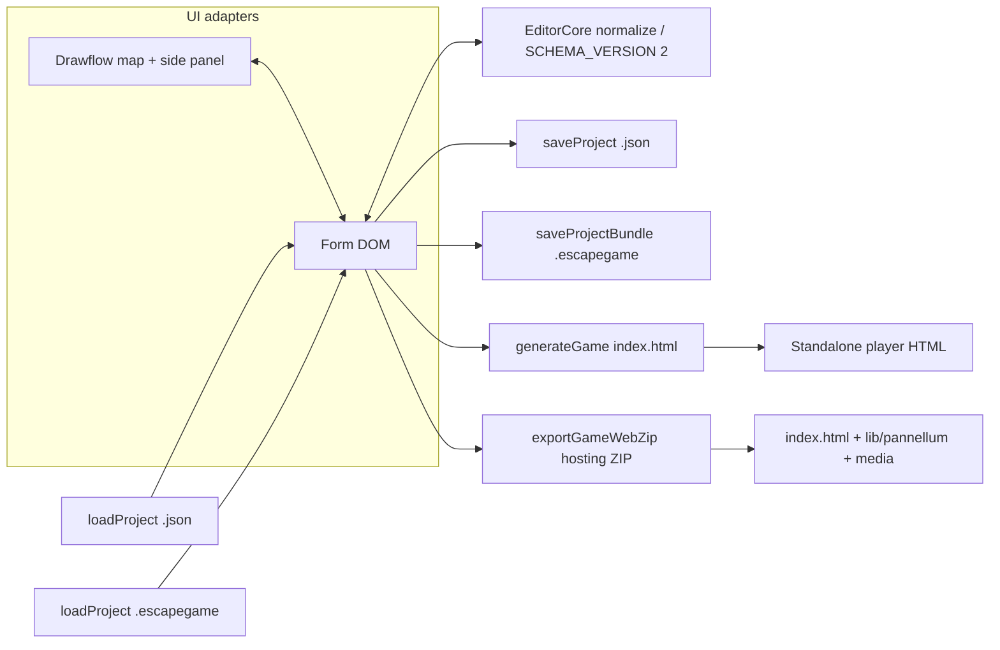
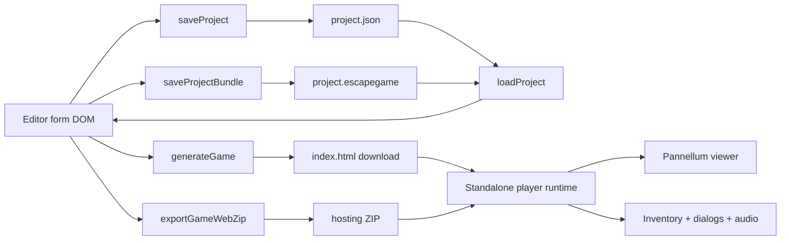
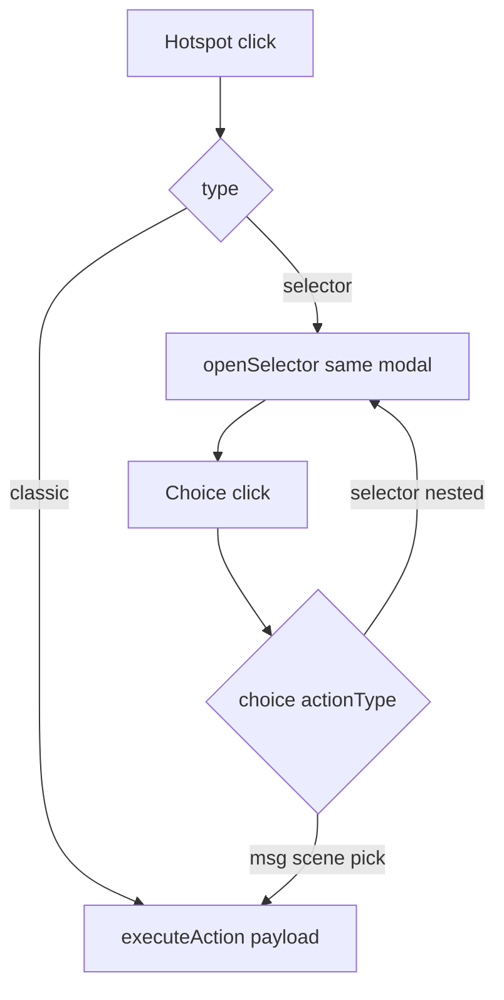

# Architecture — Escape Game 360° Maker

This document is for **developers** and **AI assistants** working on the repository. End-user instructions stay in the root [README.md](../README.md).

## Repository layout

| Path | Role |
|------|------|
| [editeur.html](../editeur.html) | Main editor (French UI): markup + `<link>` / `<script src>`. |
| [editor_en.html](../editor_en.html) | Same behavior, English UI; comments in English; default save as `project.json`. |
| [css/editor.css](../css/editor.css) | Shared editor chrome (layout, buttons, modals, form controls, **Quill** toolbar & font/size pickers). |
| [js/editor-core.js](../js/editor-core.js) | **Headless** project model V2 & unified action helpers (`EditorCore`) — **no DOM**; normalization of `payload.copy`, audio `{ url, volume }`, `legacyV1` import, **`DEFAULT_SCENE_PANORAMA_PLACEHOLDER_URL`** (jsDelivr grid PNG for new scenes). |
| [js/editor-quill-scenes.js](../js/editor-quill-scenes.js) | Quill WYSIWYG for `.editor-rich-text`, scene-ID selects, **`updateQuillTheme()`** (popup colors + font sync), Font/Size whitelist registration. |
| [js/editor-shared-bundle.js](../js/editor-shared-bundle.js) | Shared FR/EN helpers for `.escapegame` media management (blob session, portable URL rewrite, ZIP asset mapping). |
| [js/editor-shared-ui-utils.js](../js/editor-shared-ui-utils.js) | Shared FR/EN UI helpers without localized copy (collapse/reorder utilities, no-code CSS generator, pick auto-fill wiring). |
| [js/editor-shared-selector-core.js](../js/editor-shared-selector-core.js) | Shared FR/EN selector technical core (own-card field lookup, JSON textarea sync/listeners, move/remove choice helpers, textarea parsing). |
| [js/editor-shared-hotspot-serialization.js](../js/editor-shared-hotspot-serialization.js) | Shared FR/EN hotspot serialization helper (`extractHotspotData`) used by duplication and copy/export flows. |
| [js/editor-shared-action-mappers.js](../js/editor-shared-action-mappers.js) | Shared FR/EN legacy↔V2 action mappers (`legacyActionToV2`, `legacyRewardToV2`, `selectorChoiceLegacyToV2`, `actionV2ToLegacyChoice`, `actionV2ToLegacyHotspotData`) with locale options (transition label defaults). |
| [js/editor-shared-hotspot-dom-mapper.js](../js/editor-shared-hotspot-dom-mapper.js) | Shared FR/EN hotspot DOM mapper core (`hotspotDomToV2`) with locale options and injected dependencies (`selectorChoicesFromTextarea`, `legacyActionToV2`). |
| [js/editor-shared-project-serialization.js](../js/editor-shared-project-serialization.js) | Shared FR/EN project serialization core (`getCurrentProjectData`) with injected dependencies (`EditorCore`, `hotspotDomToV2`) to keep save/export mapping logic aligned between locales. |
| [js/editor-shared-preview-picker.js](../js/editor-shared-preview-picker.js) | Shared FR/EN 360 tools core for picker + scene preview (`openPicker`, `validerCoordonnees`, `closePicker`, `previewScene`, `closeScenePreview`) with locale message options. |
| [js/editeur-app.js](../js/editeur-app.js) | French editor: UI, scenes/hotspots, save/load (`.json` / **`.escapegame`** bundle), previews, **`getCurrentProjectData()`**, map hooks — everything except `generateGame`. |
| [js/editeur-generate.js](../js/editeur-generate.js) | French: `generateGame()` (player template), **`exportGameWebZip()`** (hosting ZIP), `window.onload` boot. |
| [js/editor-en-app.js](../js/editor-en-app.js) | English editor — mirrors `editeur-app.js` (including bundle save/load). |
| [js/editor-en-generate.js](../js/editor-en-generate.js) | English: `generateGame()` + **`exportGameWebZip()`** + boot; mirrors `editeur-generate.js`. |
| [xflow/project-graph.js](../xflow/project-graph.js) | **Drawflow** map: build graph from project, views (focus / full / tree), narration filter, side panel **DOM mount**. |
| [README.md](../README.md) | User-facing documentation (FR + EN). |

There is **no build step**. Open either HTML file from disk or host statically (e.g. GitHub Pages). HTML files live at the repo root; assets use relative paths (`css/`, `js/`). Typical load order: **Drawflow** → **editor-core.js** → **Quill** → **editor-quill-scenes.js** → **`*-app.js`** → **`*-generate.js`** (see each HTML file for exact `defer` order).

---

## Headless architecture — JSON schema V2 (`EditorCore`)

The editor is **decoupled** from any single UI surface: the **canonical model** is a JSON object with **`schemaVersion: 2`**, built and normalized by [`js/editor-core.js`](../js/editor-core.js) (`window.EditorCore`).

- **No `document` in `editor-core.js`** — the same rules can back the classic form, the project map, or a future React Flow view.
- **Unified `action`** on every hotspot and on every selector choice: `type`, `payload`, optional `sfx`, `visibility`.
- **`payload.copy`** — narrative and UI copy in one place:
  - **`bodyHtml`** — rich HTML (from Quill in the form); used for messages, transitions, pick text, riddles, failure messages, selector intros (`nested.copy`), etc.
  - **`buttonLabel`** — e.g. transition button label for `scene` actions.
- **Audio clips** — normalized to **`{ url: string, volume: number }`** (0–1) for global music, per-scene ambiance, and **`action.sfx`**.
- **Legacy saves** without `schemaVersion` are treated as **V1** and normalized when loaded; new saves are **V2**.

High-level flow:



---

## Hybrid UI — Drawflow map & side panel

The **project map** is a fullscreen modal using [Drawflow](https://github.com/jerosoler/Drawflow) ([`xflow/project-graph.js`](../xflow/project-graph.js)).

- **Views**: **Focus** (active scene + compact targets, double-click to refocus), **Full** (BFS-style layout from the first scene), **Tree** (acyclic / “narrative” style flow with **alias** nodes for revisits).
- **Narration mode**: optional filter (checkbox) to emphasize **scene transitions** in the graph.
- **Side panel** (`#project-map-side-content`): when the user selects a scene or hotspot node, the corresponding **`.scene-block` or hotspot block is moved in the DOM** from the main list into the panel so the **same inputs and Quill instances** are used — no duplicate forms. On close, blocks are moved back to `#scenes-container` (or equivalent) in document order.

The graph reads the current project via **`getCurrentProjectData()`** (same object as save). Renaming scene IDs is kept consistent with target `<select>`s (delegated listeners on `document.body` for `.sc-id` in `editor-quill-scenes.js`).

Strategic note: **React Flow** (or similar) is a **long-term** alternative to Drawflow if the stack gains a bundler + React; **`EditorCore` + V2 JSON** would remain the logical source of truth. See [PLAN_EDITEUR_NODAL.md](./PLAN_EDITEUR_NODAL.md).

---

## No-code rich text — Quill.js

Rich text fields use **Quill 1.x** (Snow theme), initialized by [`js/editor-quill-scenes.js`](../js/editor-quill-scenes.js) on `textarea.editor-rich-text` inside `.wysiwyg-wrap`.

- **Toolbar**: headers, **font** (whitelist: Arial, Courier, Times, Impact, Comic + “default”), **size** (small / normal / large / huge), bold/italic/underline, lists, alignment, color, clean — **no image/video** embeds (keeps JSON light, no Base64 blobs).
- **Theme sync**: **`updateQuillTheme()`** applies global **popup** settings (`#pop-bgc`, `#pop-bga`, `#pop-color`, `#useCustomPopup`, `#pop-font`) to **`.ql-editor`** via injected CSS; **`.ql-toolbar`** stays on a light background for contrast. Hooked to the same controls as the dialog preview (`updatePreview()`).
- **Player output**: `generateGame()` injects minimal CSS for **Quill alignment** (`.ql-align-*`), **fonts** (`.ql-font-*`), and **sizes** (`.ql-size-*`) inside **`.play-html-rich`** wrappers so popup `text-align: center` does not break WYSIWYG alignment.

---

## Editor shell vs generated player

1. **Editor application** — `*-app.js` + `*-generate.js` in the browser tab; builds the form, map modals, saves JSON, calls `generateGame()`.
2. **Generated output** — `generateGame()` builds a **string** (`htmlTemplate`) and triggers download of **`index.html`**: standalone player using **Pannellum from CDN** (jsDelivr). Alternatively, **`exportGameWebZip()`** builds a **ZIP** with **local `lib/pannellum`**, **`media/`**, and the same player HTML rewritten for relative paths (offline-friendly hosting).

The **player** logic is embedded as a large template literal inside `generateGame()`. Changing gameplay requires editing that template (or extracting a shared script later).

---

## Data flow (save/load/export)

```
Form DOM  →  saveProject()        →  project.json
Form DOM  →  saveProjectBundle()  →  project.escapegame (ZIP: project.json + assets/)

project.json / project.escapegame  →  loadProject()  →  rebuild DOM (addScene, addHotspot, selector state)

Form DOM  →  generateGame()      →  index.html (CDN Pannellum + current URLs)
Form DOM  →  exportGameWebZip()  →  ZIP hosting (index.html + lib/ + media/)
```



- **First scene** in document order becomes the player’s start scene.
- Scene **id** is the short id from `.sc-id` (not only the internal `scene_<n>` wrapper id). Pannellum scenes are keyed by that id.

---

## Project JSON (save file) — V2 overview

Saved files include **`schemaVersion: 2`** (via `EditorCore` / app serialization). Top-level keys include:

- **Meta**: `title`, inventory flags and styling, **custom popup** flags and styling (`popFont`, colors, opacity, buttons), **global audio** (`globalMusic` / `useGlobalAudio` with `{ url, volume }` shape where applicable).
- **`scenes`**: array of scene objects with **`id`**, **`media`** (e.g. `panoramaUrl`, **`ambiance`** as `{ url, volume }`), **`hotspots`**.

Each hotspot carries a unified **`action`** (and legacy-oriented field names may still appear in older docs — the runtime path normalizes toward **`payload.copy`** and **`sfx`**).

- **Visibility flags** live in `action.visibility`:
  - `requiresItem`
  - `hiddenIfHasItem`
  - `clickWhenInvisible` (default `true` in `EditorCore`) for hidden-but-clickable hotspot behavior in the generated player.  
    Note: selector hotspot remains non-ghost-clickable by design.

### Portable project bundle — `.escapegame` (editor)

Used to **save and reload** a project that references **local media files** (panoramas, audio, icons) without re-uploading everything manually.

- **Format**: ZIP file with extension **`.escapegame`**, containing **`project.json`** (V2) and an **`assets/`** directory; media paths in JSON look like **`./assets/...`**.
- **Implementation** (`*-app.js`): **`saveProjectBundle()`** (JSZip + FileSaver) serializes the current project with rewritten paths, embeds files from **`bundleAssets`** / **`bundleAssetPathBlobs`**. **`loadProject()`** accepts **`.json`** or **`.escapegame`**; for ZIP, **`project.json`** is parsed and files are mapped to **`blob:`** URLs for the session.
- **UX**: **`saveProject()`** (plain JSON) may **`confirm`** if **`collectPortableBundleEmbeds`** finds remaining local references — user is nudged toward **`.escapegame`** so files are not lost.

### Web ZIP export — `exportGameWebZip()` (generated player)

- **Role**: produce a **folder-ready ZIP** for static hosting or USB copy: **`index.html`**, **`lib/pannellum.*`** (fetched at export time), **`media/`** with copied assets, plus short **readme / batch** helpers for local testing (FR/EN file names differ).
- **URLs**: project media URLs are rewritten for relative **`media/`** paths where possible; stray **`blob:`** references trigger **warnings** (not portable across sessions).

### Hotspot `selector` in the project file

- Form fields **`f_sel_*`** map to nested **`action.type === "selector"`** with **`payload.nested`**: `copy.bodyHtml`, `choices[]`, `displayMode`, etc.
- **`f_sel_choices`** may hold a **JSON string** of the choices array when using the structured form; expert JSON mode is supported.
- Load/save ordering and **`deferSelectorInit`** are critical — see the mermaid and notes below (unchanged pitfalls).

```mermaid
flowchart TD
  subgraph save [Sauvegarde projet]
    S1[DOM: formulaire selector + liste de cartes] --> S2[sync vers textarea f-sel-choices si mode formulaire]
    S2 --> S3[extractHotspotData]
    S3 --> S4["f_sel_choices = string JSON du tableau choices"]
    S4 --> S5[JSON.stringify project → fichier]
  end

  subgraph load [Chargement projet]
    L1[JSON.parse fichier] --> L2[addHotspot hsData]
    L2 --> L3["updateHsFields(hId, deferSelectorInit: true)"]
    L3 --> L4[Injection HTML selector sans init]
    L4 --> L5[forEach: remplir f-sel-choices, titre, intro, display…]
    L5 --> L6{selJsonExpertMode ?}
    L6 -->|oui| L7[toggleSelectorJsonExpert]
    L6 -->|non| L8[initSelectorChoicesForm]
    L8 --> L9["JSON.parse ta.value → racine + nested récursif"]
    L9 --> L10["Pour chaque choix: renderChoiceCardElement(ch, hId, depth)"]
    L10 --> L11["appendChild: carte créée hors document → hId explicite dans rebuild"]
    L11 --> L12[attachSelectorChoicesListeners + sync textarea]
  end
```



**Pitfalls**

1. **`renderChoiceCardElement`** — pass **`hId`** explicitly when the card is not yet in the DOM (`closest('.hotspot-block')` may be null).
2. **Load order** — do not call **`initSelectorChoicesForm`** before restoring **`f_sel_choices`** from JSON.
3. **Serialization** — scope queries to the current card (avoid leaking `sfxUrl` between parent and nested cards).

---

## Editor: main functions (reference)

| Function | Purpose |
|----------|---------|
| `addScene` / `addHotspot` | Inject scene or hotspot blocks; defaults for new items. |
| `getCurrentProjectData` | Build the **V2** project object from the DOM (used by save, map, generate). |
| `extractHotspotData` | Serialize one hotspot for JSON or duplication. |
| `duplicateHotspot` / `duplicateScene` | Copy helpers. |
| `buildCss` / `toggleExpertMode` | No-code CSS vs raw textarea. |
| `openPicker` / `previewScene` | Fullscreen Pannellum for coordinates / scene preview. |
| `updateHsFields` | Swap dynamic fields by hotspot type; **`deferSelectorInit`** on load. |
| Selector helpers | `initSelectorChoicesForm`, `renderChoiceCardElement`, `syncSelectorChoicesToTextarea`, etc. |
| `saveProject` / `loadProject` | JSON persistence (V2 + legacy load); **`loadProject`** also accepts **`.escapegame`**. |
| `saveProjectBundle` | Build **`.escapegame`** (ZIP: `project.json` + `assets/`). |
| `updatePreview` | Inventory + dialog preview; calls **`updateQuillTheme()`** when present. |
| `generateGame` | Read project → build player template → download **`index.html`**. |
| `exportGameWebZip` | Read project → fetch Pannellum → build **hosting ZIP** (`lib/`, `media/`, …). |
| `refreshProjectMapGraphInPlace` / `setProjectMapView` | Regenerate or switch map view (`project-graph.js`). |

Hotspot **types** in the player are handled in **`hotspotDispatcher`** inside the generated script.

---

## Pannellum integration

- Editor previews: `pannellum.viewer` on `#picker-panorama` and `#scene-preview-panorama`.
- Player: single viewer on `#panorama` with `default.firstScene` and `scenes` object.

Hotspots use `createTooltipFunc` pointing to **`hotspotDispatcher`** (a real function in the player). The config is built with `JSON.stringify` then a string replace converts `"createTooltipFunc": "hotspotDispatcher"` to a **bare identifier** so the output is valid JavaScript.

**Player modals** (`openSelector`, `afficherPopup`, password riddle) share the same visual chrome: dimmed overlay, centered panel, rounded corners.

Scene changes: player listens to **`scenechange`** and applies per-scene **ambiance** audio.

---

## Audio (player)

- **Music**: optional loop; URL from global settings; started after splash.
- **Ambiance**: loop per scene from scene media **`{ url, volume }`** map; empty URL stops the channel.
- **SFX**: one-shot channel; **`stopSFX()`** on selector close / back from inline message.
- **Selector + message**: choice type `msg` shows inline scroll in the same overlay; **pick** may open inventory when enabled.

Splash screen exists so audio can start after a **user gesture** (browser autoplay policies).

### HUD & player settings (implemented)

- **`#player-hud`**: corner placement follows editor **inventory position** (`invPos`). **Inventory** toggle (optional) and **settings** (gear) sit **side by side** in `.player-hud-icons` so they never overlap.
- **Settings modal** (`#settings-modal`): uses the same **popup theme** as narrative dialogs (`popFont`, popup colors / buttons from project). Sliders: **Master**, **Music**, **Ambiance**, **SFX** (defaults 1.0). Effective level is **`master × channel × clipVolume`**, where **`clipVolume`** comes from the editor (per clip).
- **Persistence**: channel + master values are saved in **`localStorage`** under **`escape360_player_audio_v1`** and restored when the player starts after the splash screen.
- **Custom icons (inventory)**: image URLs use **`player-hud-icon-img`** with **`em` / `max-*` sizing** (no fixed pixel frame) so future designer-provided assets scale cleanly; the settings control is still a text/emoji placeholder until a dedicated project field exists.

### Piste : menu in-game unifié (futur)

Aujourd’hui, **inventaire** et **réglages** sont deux entrées séparées dans le HUD. Une évolution possible : un **hub unique** (icône « menu » ou équivalent) ouvrant un panneau avec des **boutons ou onglets** — **Inventaire**, **Paramètres**, et plus tard **journal de quête / log**, **carte**, **indices** (difficulté), **langue**, etc. On pourra **réutiliser partiellement** la logique des overlays déjà présents (**selector**, popups centrées, styles `popFont`) tout en gardant le **JSON V2** comme contrat côté éditeur. Les assets d’icônes resteraient des **chemins / URLs** avec mise en page **flexible** (comme ci-dessus), pas des tailles figées en pixels.

---

## Notable DOM hooks

- `#scenes-container` — primary home for `.scene-block` elements (may be temporarily moved to the map side panel).
- `#project-map-side-content` — side panel host during map edit.
- `.sc-id`, `.sc-img`, `.sc-title`, `.sc-audio` per scene.
- `.hotspot-block`, `.hs-pitch`, `.hs-yaw`, `.hs-type`, `#fields_<id>`, `.editor-rich-text` / `.wysiwyg-wrap`.

---

## Hosting and CORS

- **HTTPS URLs** for panoramas/audio are the most reliable when testing from `file://` is problematic.
- Local relative paths (`./image.jpg`) work when the game is served from a proper origin (same folder as assets).

---

## Roadmap (high level)

Aligned with [README.md](../README.md):

- **Chemin A** — **Web hosting ZIP** (`exportGameWebZip`) and **editor bundle** (`.escapegame`) are **implemented**; remaining work is polish, multi-file stories, and stricter **versioning** once the beta stabilizes.
- **Chemin B (long term)** — **React Flow** (or similar) replacing Drawflow only if the project adopts a richer front-end stack; keep **`EditorCore` + V2** as the contract.

Other ideas: **unified in-game menu hub** (see [Audio (player)](#audio-player)), editor draft autosave / restore, player progression persistence options, multi-level games + `localStorage` inventory handoff, picked-item persistence across revisits, i18n beyond dual HTML files.

---

## Hotspot `selector` (implemented)

Full spec: [SELECTOR_SPEC.md](./SELECTOR_SPEC.md).

**Nodal plan (delivered vs future)**: [PLAN_EDITEUR_NODAL.md](./PLAN_EDITEUR_NODAL.md).



---

## Versioning

User-facing **feature list** and **release notes** live in the root [README.md](../README.md). This file tracks **technical** structure and extension points for contributors and AI assistants.
